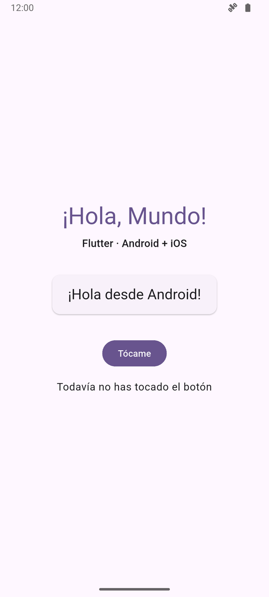

# Inicio en Windows — de cero a HolaMundoFlutter corriendo

Flutter es el **framework**; el **lenguaje** es **Dart**, y viene incluido. Esta guía deja lista una
computadora con Windows para correr este proyecto en Android. Calcula una hora y unos 15 GB libres.
También necesitas Git o GitHub Desktop.

```
1 · VS Code y su extensión      4 · Licencias de Android
2 · Flutter                     5 · Un emulador (o tu teléfono)
3 · Android Studio y su SDK     6 · flutter doctor y HolaMundoFlutter
```

> **Memoria:** con 8 GB de RAM el emulador va lento, y más si Docker está abierto. Si tu computadora
> sufre, usa un teléfono Android conectado por USB (paso 5).

---

## 1 · VS Code y la extensión de Flutter

Instala [Visual Studio Code](https://code.visualstudio.com/). Ábrelo, ve a **Extensiones**
(Ctrl + Shift + X), busca **Flutter** e instala la de *Dart Code*. Se instala también la de Dart.

## 2 · Flutter, desde VS Code

1. **Ctrl + Shift + P**, escribe `flutter` y elige **Flutter: New Project**.
2. Te pedirá ubicar el SDK: pulsa **Download SDK**.
3. Elige una carpeta **sin espacios ni acentos, fuera de OneDrive y de *Archivos de programa***:
   - Si tu usuario de Windows no tiene espacios ni acentos: `C:\Users\tu-usuario\dev`
   - Si los tiene (por ejemplo `C:\Users\José Pérez`): `C:\dev`
4. Pulsa **Clone Flutter**. Tarda unos minutos.
5. Cuando termine, pulsa **Add SDK to PATH**.

**Cierra todas las terminales y abre una nueva**; si no, no encuentra el comando. Comprueba:

```bash
flutter --version
```

```
Flutter 3.47.6 • channel stable • https://github.com/flutter/flutter.git
Framework • revision 5fc346839b (9 days ago) • 2026-09-30 15:02:49 -0700
Engine • hash b8c8d3d8d5d0095127057f8a29ca8cc53da2167c (revision 692136cb65) (9 days ago) • 2026-09-30 00:56:59.000Z
Tools • Dart 3.13.5 • DevTools 2.60.0
```

El número puede ser más nuevo; lo importante es que diga `channel stable`.

## 3 · Android Studio y su SDK

1. Instala [Android Studio](https://developer.android.com/studio). En el asistente del primer
   arranque elige **Standard**: descarga el SDK de Android.
2. En la pantalla de bienvenida: **More Actions → SDK Manager**, pestaña **SDK Tools**. Marca, si no
   lo están:
   - **Android SDK Command-line Tools (latest)** ← la que más se olvida
   - Android SDK Build-Tools
   - Android SDK Platform-Tools
   - Android Emulator
3. Pulsa **Apply** y espera.

## 4 · Las licencias de Android

En una terminal:

```bash
flutter doctor --android-licenses
```

Lee cada licencia y acepta escribiendo `y`. Sin este paso, Android no compila.

## 5 · Un emulador (o tu teléfono)

**Emulador:** en Android Studio, **More Actions → Virtual Device Manager**, pulsa **+** y elige un
teléfono (por ejemplo, *Medium Phone*) con la versión de Android más reciente. Comprueba que Flutter
lo ve:

```bash
flutter emulators
```

Debe aparecer el que creaste. En la computadora donde se probó esta guía hay dos:

```
Id              • Name            • Manufacturer • Platform

HolaMundo_Phone • HolaMundo Phone • Generic      • android
Medium_Phone    • Medium Phone    • Generic      • android
```

> **Si el emulador no arranca** y menciona aceleración o hipervisor: busca *Activar o desactivar las
> características de Windows*, marca **Plataforma del hipervisor de Windows** y reinicia. Es la misma
> virtualización que usa Docker, así que los dos conviven.

**Teléfono:** en *Ajustes → Acerca del teléfono*, toca siete veces *Número de compilación* para
activar las opciones de desarrollador; ahí activa **Depuración USB** y conéctalo. Acepta el aviso que
aparece en el teléfono. Comprueba que aparece en la lista:

```bash
flutter devices
```

## 6 · `flutter doctor` y HolaMundoFlutter

```bash
flutter doctor
```

Así se ve con Android Studio instalado pero sin los pasos 3.2 y 4, los dos olvidos más comunes:

```
Doctor summary (to see all details, run flutter doctor -v):
[√] Flutter (Channel stable, 3.47.6, on Microsoft Windows [Versión 10.0.26200.9457], locale es-MX)
[√] Windows Version (Windows 11 or higher, 25H2, 2009)
[!] Android toolchain - develop for Android devices (Android SDK version 36.0.0)
    X cmdline-tools component is missing.
      Try installing or updating Android Studio.
      Alternatively, download the tools from https://developer.android.com/studio#command-line-tools-only and make sure to set the ANDROID_HOME environment variable.
      See https://developer.android.com/studio/command-line for more details.
    X Android license status unknown.
      Run `flutter doctor --android-licenses` to accept the SDK licenses.
      See https://flutter.dev/to/windows-android-setup for more details.
[√] Chrome - develop for the web
[√] Visual Studio - develop Windows apps (Visual Studio Build Tools 2026 18.5.1)
[√] Connected device (3 available)
[√] Network resources

! Doctor found issues in 1 category.
```

| Si dice… | Haz… |
|---|---|
| `cmdline-tools component is missing` | Paso 3, la casilla de *Command-line Tools* |
| `Android license status unknown` | Paso 4 |

**Ya terminaste cuando las líneas de `Flutter` y `Android toolchain` tienen [√].** Las de *Chrome* y
*Visual Studio* son para web y apps de Windows; este proyecto no las usa, así que pueden tener [X].

La prueba final. Con el emulador abierto (o el teléfono conectado), en una carpeta sin acentos ni
OneDrive, por ejemplo `C:\dev`:

```bash
git clone https://github.com/gabrielhuav/Flutter-Projects.git
```

```bash
cd Flutter-Projects/HolaMundoFlutter
```

```bash
flutter pub get
```

```bash
flutter run
```

La primera compilación tarda varios minutos: descarga Gradle y sus dependencias. Cuando el emulador
muestre **¡Hola desde Android!** y el contador, todo quedó instalado. Lo que sigue está en el
[tutorial del proyecto](README.es.md).



**¿También Kotlin Multiplatform?** Con Android Studio ya tienes lo necesario: sigue
[HolaMundoKMP](https://github.com/gabrielhuav/HolaMundoKMP).

---

## Si algo sale mal

| Lo que sale | Qué hacer |
|---|---|
| `'flutter' no se reconoce como un comando` | Cierra **todas** las terminales y abre otra. Si sigue, repite *Add SDK to PATH* |
| `Your project path contains non-ASCII characters` u otros errores con rutas | Flutter o el proyecto quedaron en una carpeta con espacios, acentos o en OneDrive: muévelos a `C:\dev` |
| `Filename too long` al clonar | La carpeta está muy adentro y la ruta pasa de 260 caracteres: clona en `C:\dev` |
| `cmdline-tools component is missing` | Paso 3 |
| `Android license status unknown` | Paso 4 |
| El emulador no arranca (aceleración, hipervisor) | Nota del paso 5 |
| `No supported devices connected` | Abre el emulador o conecta el teléfono antes de `flutter run` |
| La primera compilación lleva mucho tiempo | Es normal: está descargando Gradle. Las siguientes son rápidas |
