<p align="center">
  <a href="README.md"></a>
  <a href="README.es.md"></a>
</p>

# HolaMundoFlutter — tu primera app multiplataforma con Flutter

Un **¡Hola Mundo! escrito una sola vez en Dart**, con **Flutter** para compartir la pantalla y la lógica entre **Android e iOS**. La app muestra un saludo del sistema, cuenta los toques y sigue el tema claro u oscuro del teléfono.

Este es un **tutorial paso a paso para principiantes**, desde una carpeta vacía: explica qué genera Flutter, qué escribe cada archivo y cómo probarlo. Primero ejecutamos Android; después preparamos iOS en una Mac. Si solo quieres probar la app, empieza por los comandos rápidos del índice.

| Android (emulador HolaMundo_Phone) | iOS (simulador) | iPhone real |
|:---:|:---:|:---:|
|  | 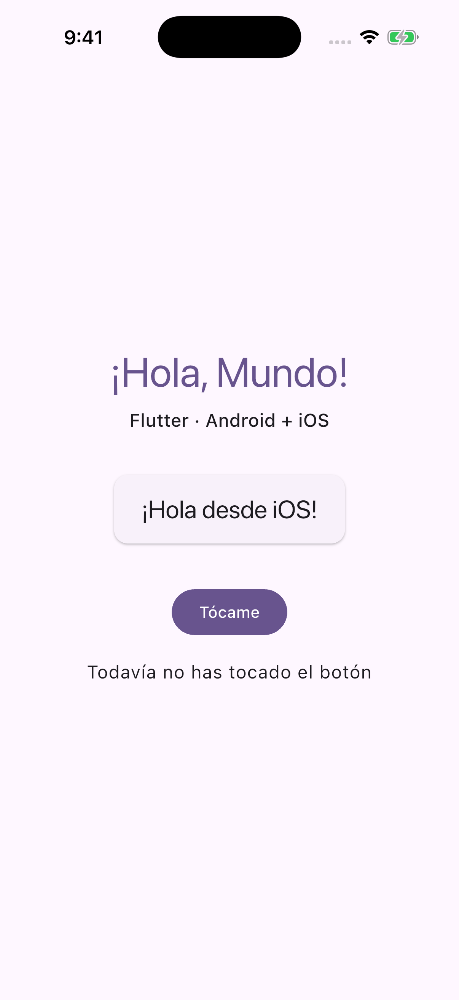 | Captura pendiente (iPhone físico) |

Las dos plataformas usan `lib/main.dart`; el saludo consulta `nombrePlataforma()`. **Android está verificado en Windows; iOS está verificado en el simulador iPhone 17 Pro (iOS 26.5), el 2026-10-08. El iPhone físico sigue pendiente.** Las imágenes genéricas de ajustes de iPhone más adelante no prueban que esta app haya corrido en iOS.

**¿Empiezas sin VS Code ni Flutter?** Sigue [la guía de inicio en Windows](INICIO-WINDOWS.md) o [la de Mac](INICIO-MAC.md); esta app vive dentro del repositorio `Flutter-Projects`.

---

## Índice

- [Conceptos en 3 minutos](#conceptos-en-3-minutos)
- [Qué necesitas instalar](#qué-necesitas-instalar)
- [Si solo quieres correrlo](#si-solo-quieres-correrlo)
- [Parte 1 — Android](#parte-1--android)
- [1.1 Crear el proyecto desde una carpeta vacía](#11-crear-el-proyecto-desde-una-carpeta-vacía)
- [1.2 pubspec.yaml: la ficha del proyecto](#12-pubspecyaml-la-ficha-del-proyecto)
- [1.3 analysis_options.yaml y flutter analyze](#13-analysis_optionsyaml-y-flutter-analyze)
- [1.4 lib/saludo.dart: lógica pura](#14-libsaludodart-lógica-pura)
- [1.5 lib/plataforma.dart: detectar el sistema](#15-libplataformadart-detectar-el-sistema)
- [1.6 lib/main.dart: la app y la pantalla](#16-libmaindart-la-app-y-la-pantalla)
- [1.7 La carpeta android/: el anfitrión nativo](#17-la-carpeta-android-el-anfitrión-nativo)
- [1.8 Abrir en VS Code y Android Studio](#18-abrir-en-vs-code-y-android-studio)
- [1.9 Crear el emulador](#19-crear-el-emulador)
- [1.10 ¡Ejecutar en Android!](#110-ejecutar-en-android)
- [1.11 Hot reload frente a hot restart](#111-hot-reload-frente-a-hot-restart)
- [1.12 Pruebas: flutter test](#112-pruebas-flutter-test)
- [Parte 2 — iOS (solo Mac)](#parte-2--ios-solo-mac)
- [2.1 Preparar Xcode y Flutter](#21-preparar-xcode-y-flutter)
- [2.2 La carpeta ios/: AppDelegate y escenas](#22-la-carpeta-ios-appdelegate-y-escenas)
- [2.3 Ejecutar en el simulador](#23-ejecutar-en-el-simulador)
- [2.4 Ejecutar en un iPhone real](#24-ejecutar-en-un-iphone-real)
- [2.5 Equivalencias entre Android e iOS](#25-equivalencias-entre-android-e-ios)
- [Parte 3 — ¿Y ahora qué?](#parte-3--y-ahora-qué)
- [3.1 El mismo cambio en las dos plataformas](#31-el-mismo-cambio-en-las-dos-plataformas)
- [3.2 Ejercicio: botón Reiniciar y su prueba](#32-ejercicio-botón-reiniciar-y-su-prueba)
- [3.3 Siguientes pasos recomendados](#33-siguientes-pasos-recomendados)
- [Parte 4 — Usar este repo como base para tu app](#parte-4--usar-este-repo-como-base-para-tu-app)
- [4.1 Qué necesitas para que corra](#41-qué-necesitas-para-que-corra)
- [4.2 Qué cambiar para que sea TU app](#42-qué-cambiar-para-que-sea-tu-app)
- [4.3 Qué conviene no cambiar](#43-qué-conviene-no-cambiar)
- [4.4 Íconos y revisión del nombre viejo](#44-íconos-y-revisión-del-nombre-viejo)
- [Problemas frecuentes](#problemas-frecuentes)
- [Versiones usadas](#versiones-usadas)
- [Estructura final](#estructura-final)
- [Capturas pendientes](#capturas-pendientes)

## Conceptos en 3 minutos

**Flutter** es el kit de Google para construir interfaces y compilar aplicaciones desde un mismo proyecto. **Dart** es el lenguaje en que escribimos esta app. Flutter incluye su SDK: no necesitas descargar Dart aparte. Aquí compartimos tanto los textos y el contador como la pantalla entre Android e iOS.

Un **widget** describe una parte de la interfaz: un texto, un botón, un espacio o una pantalla entera. Los widgets se componen: una `Column` contiene varios `Text` y un botón; `Center` centra esa columna. El método `build()` devuelve esa descripción y puede ejecutarse muchas veces. No metas operaciones largas ni descargas dentro de `build()`.

| Concepto | En esta app |
|---|---|
| `StatelessWidget` | `HolaMundoApp` recibe `plataforma` y configura el tema; no guarda un contador propio. Puede reconstruirse si cambian sus entradas. |
| `StatefulWidget` | `PantallaInicio` tiene un objeto `State` separado, donde vive `_veces`. El widget describe la configuración; el `State` guarda lo que cambia. |
| `setState` | Cambia `_veces` y pide reconstruir la pantalla para mostrar el texto nuevo. Su función debe ser síncrona. |
| Hot reload | Carga cambios de Dart durante una sesión debug y conserva el estado. No vuelve a ejecutar `main()`. |
| Carpetas nativas | `android/` e `ios/` arrancan Flutter y contienen permisos, identificadores, íconos y ajustes de compilación. |

El flujo es `main()` → `HolaMundoApp` → `MaterialApp` → `PantallaInicio`. El saludo llega de una función pura, y el nombre del sistema llega de `nombrePlataforma()`.

| | Flutter (este repo) | [Kotlin Multiplatform (HolaMundoKMP)](https://github.com/gabrielhuav/HolaMundoKMP) |
|---|---|---|
| Lenguaje compartido | Dart | Kotlin |
| Interfaz de estos ejemplos | Widgets de Flutter | Compose Multiplatform |
| Código compartido | `lib/` | `shared/src/commonMain/` |
| Diferencias del sistema | `Platform`, plugins o canales de plataforma | Source sets y `expect` / `actual` |
| Proyecto Android / iOS | `android/` / `ios/` | `androidApp/` / `iosApp/` |

KMP puede compartir solo lógica y conservar interfaces nativas; el ejemplo de referencia usa Compose para compartir también la interfaz. No hay que traducir los archivos de Kotlin del tutorial KMP a este proyecto: Flutter ya genera sus anfitriones nativos.

## Qué necesitas instalar

| Herramienta | Windows: Android | Mac: Android + iOS | Para qué |
|---|---|---|---|
| Flutter SDK | Sí | Sí, distribución para macOS | Incluye Dart, herramientas y motor de Flutter. |
| Android Studio | Sí | Sí para Android | Incluye SDK, Device Manager, emulador y un JDK. |
| VS Code + extensión Flutter de Dart Code | Recomendado | Recomendado | La extensión añade soporte de Dart, depuración y selección de dispositivo. |
| Xcode | No disponible | Sí para iOS | Compilar, firmar y usar simuladores de iPhone. |
| CocoaPods | No para Android | Solo si los plugins nativos lo requieren | Dependencias nativas de iOS; este ejemplo no añade plugins de cámara, GPS, etc. |
| Git o GitHub Desktop | Sí | Sí | Descargar el repositorio y revisar cambios. |

1. Sigue la [instalación oficial de Flutter](https://docs.flutter.dev/install) para tu sistema; coloca el SDK en una ruta sencilla y asegúrate de que su carpeta `bin` esté en el PATH siguiendo esa guía.
2. En Android Studio, termina el asistente y revisa **SDK Manager**: SDK Platform, Platform-Tools, Android SDK Command-line Tools y Android Emulator.
3. En VS Code abre Extensiones y busca **Flutter**, publicada por **Dart Code**; se instala también Dart. Android Studio es un editor alternativo si ya tienes los plugins Flutter/Dart.
4. Abre una terminal nueva y revisa la instalación:
```bash
flutter --version
```

```bash
flutter doctor
```


### Cómo leer flutter doctor

Para Android revisa Flutter, **Android toolchain**, Android Studio y un dispositivo conectado. Para iOS revisa también Xcode en la Mac. Los avisos de Visual Studio son para aplicaciones de escritorio Windows; no bloquean este tutorial Android/iOS. La primera descarga de paquetes y de la imagen del emulador necesita internet y espacio libre.

Si faltan licencias del SDK, lee y acepta las que correspondan:
```bash
flutter doctor --android-licenses
```


## Si solo quieres correrlo

**1. Clona el repositorio.** En GitHub Desktop: **File → Clone repository… → URL**, pega `https://github.com/gabrielhuav/Flutter-Projects.git` y elige una carpeta. En Windows usa una ruta sin acentos, por ejemplo `C:\dev`. Desde una terminal:
```bash
git clone https://github.com/gabrielhuav/Flutter-Projects.git
```

```bash
cd Flutter-Projects/HolaMundoFlutter
```

```bash
flutter pub get
```


### Elige el dispositivo y ejecuta

**2. Enciende un emulador Android** desde Device Manager o conecta un teléfono con Depuración USB. En Mac también puedes abrir un simulador de iPhone (Parte 2). **3. Ejecuta desde la raíz**, donde está `pubspec.yaml`:
```bash
flutter devices
```

```bash
flutter run
```


# Parte 1 — Android

Vamos a construirlo en el orden de los archivos: primero la ficha del proyecto, después la lógica, la plataforma y la pantalla, y finalmente el anfitrión Android. Si ya clonaste este repo, los archivos están listos: léelos y compara; no ejecutes `flutter create` encima de tu copia para seguir el tutorial.

Los comandos se ejecutan desde una terminal de VS Code, Android Studio o PowerShell. Cada bloque contiene **un solo comando**. Copia el comando sin los delimitadores del bloque; no hace falta escribir un `$` delante.

## 1.1 Crear el proyecto desde una carpeta vacía

Abre una terminal en una carpeta de trabajo vacía, por ejemplo `C:\dev` en Windows. El comando crea **otra carpeta llamada HolaMundoFlutter** dentro de ella. `--org` fija el prefijo de los identificadores, `--project-name` fija el nombre Dart (minúsculas y guiones bajos), y `--platforms` genera solo los anfitriones Android e iOS.
```bash
flutter create --org com.example --project-name hola_mundo_flutter --platforms android,ios HolaMundoFlutter
```

```bash
cd HolaMundoFlutter
```


### Qué genera Flutter y qué vas a reemplazar

| Archivo o carpeta | Qué genera / qué haremos |
|---|---|
| `pubspec.yaml`, `pubspec.lock` | Dependencias y versiones resueltas. Mantén el lock para reproducir la app. |
| `analysis_options.yaml` | Reglas de análisis. |
| `lib/main.dart` | Contador de ejemplo; reemplázalo por el archivo completo de 1.6. |
| `lib/saludo.dart`, `lib/plataforma.dart` | No los crea la plantilla: créalos en 1.4 y 1.5. |
| `test/widget_test.dart` | Prueba del contador de plantilla; reemplázala por 1.12. Añade `saludo_test.dart`. |
| `android/`, `ios/` | Proyectos nativos y recursos iniciales. En 1.7 y 2.2 compara su configuración. |
| `.gitignore`, `.metadata` | Exclusiones y metadatos que usa Flutter. |

El tutorial documenta **el código real de este repo**, creado con Flutter 3.47.6. Una versión distinta de Flutter puede generar otros archivos. El comando de creación no produce automáticamente nuestros saludos ni el nombre visible personalizado. Los fragmentos enlazados a un archivo se copian de él; las propuestas de ejercicios se marcan expresamente como cambios opcionales.

No copies `build/`, `.dart_tool/` ni rutas personales como `android/local.properties` desde otra computadora. Flutter regenera esos datos en cada equipo.

## 1.2 pubspec.yaml: la ficha del proyecto

Este es el contenido del archivo real **sin los comentarios y líneas vacías de la plantilla**. En tu proyecto nuevo conserva estas entradas y la indentación (YAML usa espacios, no tabuladores):
[`pubspec.yaml`](pubspec.yaml):

```yaml
name: hola_mundo_flutter
description: "Hola Mundo multiplataforma con Flutter (Android + iOS)"
publish_to: 'none' # Remove this line if you wish to publish to pub.dev
version: 1.0.0+1
environment:
  sdk: ^3.8.0
dependencies:
  flutter:
    sdk: flutter
  cupertino_icons: ^1.0.8
dev_dependencies:
  flutter_test:
    sdk: flutter
  flutter_lints: ^6.0.0
flutter:
  uses-material-design: true
```


### Cómo leer las dependencias

| Entrada | Significado |
|---|---|
| `name` | Nombre del paquete Dart. Los imports de las pruebas empiezan por `package:hola_mundo_flutter/`. |
| `publish_to: 'none'` | Evita publicar este paquete por accidente en pub.dev. |
| `version: 1.0.0+1` | Versión visible `1.0.0` y número de compilación `1`. Android e iOS reciben esos valores. |
| `environment.sdk: ^3.8.0` | Restricción admitida para Dart; **no** es la versión instalada, que aquí es 3.13.5. |
| `flutter` con `sdk: flutter` | Framework que viene en el SDK instalado. |
| `cupertino_icons` | Fuente de íconos estilo iOS; no es un plugin nativo que necesite CocoaPods. |
| `flutter_test` | Herramientas para las pruebas, solo durante el desarrollo. |
| `flutter_lints: ^6.0.0` | Reglas recomendadas que activa `analysis_options.yaml`. |
| `uses-material-design: true` | Incluye la fuente de íconos de Material. |

Después de cambiar dependencias descarga los paquetes. `pubspec.lock` registra lo que se resolvió; no lo edites a mano.
```bash
flutter pub get
```


## 1.3 analysis_options.yaml y flutter analyze

El analizador encuentra errores de Dart y recomendaciones de estilo sin encender un teléfono. `include` activa flutter_lints; `exclude` evita analizar los directorios indicados como Dart. Esto **no** desactiva las comprobaciones de Gradle ni de Xcode. Fragmento literal del archivo real:
[`analysis_options.yaml`](analysis_options.yaml):

```yaml
include: package:flutter_lints/flutter.yaml

analyzer:
  exclude:
    - build/**
    - android/**
    - ios/**
```

```bash
flutter analyze
```


### Resultado real del análisis

Salida de la verificación en Windows de este tutorial (solo la línea de resultado; el tiempo depende del equipo):
```text
No issues found! (ran in 17.6s)
```


## 1.4 lib/saludo.dart: lógica pura

Crea este archivo dentro de `lib/`. No importa Flutter: transforma datos en textos. `=>` es una función de una expresión. El `switch` devuelve un texto para 0, otro para 1 y usa `_` como caso restante. `$plataforma` y `$veces` insertan valores en una cadena.
[`lib/saludo.dart`](lib/saludo.dart):

```dart
/// Lógica pura: no sabe nada de pantallas, ni de Android, ni de iOS.
/// Por eso se puede probar con pruebas unitarias (ver test/saludo_test.dart).
library;

/// Saludo que se muestra en la tarjeta, por ejemplo "¡Hola desde Android!".
String saludar(String plataforma) => '¡Hola desde $plataforma!';

/// Texto del contador con la palabra en singular o plural.
String textoContador(int veces) => switch (veces) {
      0 => 'Todavía no has tocado el botón',
      1 => 'Has tocado el botón 1 vez',
      _ => 'Has tocado el botón $veces veces',
    };
```


## 1.5 lib/plataforma.dart: detectar el sistema

Crea este segundo archivo. `show` importa solo el símbolo indicado. `Platform.isAndroid` y `Platform.isIOS` responden en tiempo de ejecución; no hay que mantener dos archivos de saludo. La función devuelve `Android` o `iOS`, que después recibe `saludar()`.
[`lib/plataforma.dart`](lib/plataforma.dart):

```dart
import 'dart:io' show Platform;

import 'package:flutter/foundation.dart' show kIsWeb;

/// Nombre del sistema operativo en el que corre la app.
///
/// El mismo código Dart se compila para Android y para iOS; `Platform` nos
/// dice en cuál estamos en tiempo de ejecución.
String nombrePlataforma() {
  if (kIsWeb) return 'la Web'; // dart:io no existe en la Web: se revisa antes.
  if (Platform.isAndroid) return 'Android';
  if (Platform.isIOS) return 'iOS';
  return Platform.operatingSystem; // windows, macos, linux…
}
```


### Alcance de la detección de plataforma

La comprobación `kIsWeb` aparece antes de consultar `Platform`, pero este proyecto se creó para **Android e iOS**: no incluye un anfitrión `web/` ni se ha validado para Web. El import directo de `dart:io` requiere revisar la compatibilidad web y, si corresponde, imports condicionales cuando amplíes destinos. El caso restante devuelve el nombre del sistema para otros entornos, sin garantizar que exista su carpeta nativa.

El parámetro `plataforma` también permite que las pruebas pasen `'Pruebas'`: así no dependen de si la computadora que ejecuta la prueba usa Windows, Linux o macOS.

## 1.6 lib/main.dart: la app y la pantalla

Reemplaza **todo** el contador de la plantilla por este archivo real. Los imports relativos encuentran los dos archivos anteriores en `lib/`. `main()` llama a `runApp`, que coloca el primer widget en pantalla. La interfaz permanece en español también al seguir el README en inglés.
[`lib/main.dart`](lib/main.dart):

```dart
import 'package:flutter/material.dart';

import 'plataforma.dart';
import 'saludo.dart';

/// Punto de entrada: Android e iOS arrancan AQUÍ, con el mismo código.
void main() {
  runApp(HolaMundoApp(plataforma: nombrePlataforma()));
}

/// La app completa. Recibe el nombre de la plataforma como parámetro para
/// que las pruebas puedan pasarle uno "de mentira" (ver test/widget_test.dart).
class HolaMundoApp extends StatelessWidget {
  const HolaMundoApp({super.key, required this.plataforma});

  final String plataforma;

  @override
  Widget build(BuildContext context) {
    return MaterialApp(
      title: 'Hola Mundo Flutter',
      debugShowCheckedModeBanner: false,
      // Tema claro u oscuro según el sistema del teléfono.
      themeMode: ThemeMode.system,
      theme: ThemeData(
        colorSchemeSeed: Colors.deepPurple,
        brightness: Brightness.light,
      ),
      darkTheme: ThemeData(
        colorSchemeSeed: Colors.deepPurple,
        brightness: Brightness.dark,
      ),
      home: PantallaInicio(plataforma: plataforma),
    );
  }
}

/// La pantalla. Es `StatefulWidget` porque guarda un dato que cambia: el contador.
class PantallaInicio extends StatefulWidget {
  const PantallaInicio({super.key, required this.plataforma});

  final String plataforma;

  @override
  State<PantallaInicio> createState() => _PantallaInicioState();
}

class _PantallaInicioState extends State<PantallaInicio> {
  int _veces = 0;

  void _tocar() {
    // setState avisa a Flutter que el estado cambió y que debe redibujar.
    setState(() => _veces++);
  }

  @override
  Widget build(BuildContext context) {
    final tema = Theme.of(context);

    return Scaffold(
      body: SafeArea(
        child: Center(
          child: Padding(
            padding: const EdgeInsets.all(24),
            child: Column(
              mainAxisSize: MainAxisSize.min,
              children: [
                Text(
                  '¡Hola, Mundo!',
                  style: tema.textTheme.displaySmall?.copyWith(
                    color: tema.colorScheme.primary,
                  ),
                ),
                const SizedBox(height: 8),
                Text(
                  'Flutter · Android + iOS',
                  style: tema.textTheme.titleMedium,
                ),
                const SizedBox(height: 32),
                Card(
                  child: Padding(
                    padding: const EdgeInsets.symmetric(
                      horizontal: 24,
                      vertical: 16,
                    ),
                    child: Text(
                      saludar(widget.plataforma),
                      style: tema.textTheme.titleLarge,
                    ),
                  ),
                ),
                const SizedBox(height: 32),
                FilledButton(
                  onPressed: _tocar,
                  child: const Text('Tócame'),
                ),
                const SizedBox(height: 16),
                Text(
                  textoContador(_veces),
                  style: tema.textTheme.bodyLarge,
                  textAlign: TextAlign.center,
                ),
              ],
            ),
          ),
        ),
      ),
    );
  }
}
```


### Leer el árbol de widgets y el estado

`HolaMundoApp` configura `MaterialApp`: `title` es un título interno, y **no** cambia el nombre bajo el ícono del sistema. `debugShowCheckedModeBanner: false` oculta la cinta DEBUG. `ThemeMode.system` elige `theme` o `darkTheme` según el teléfono; ambos construyen colores a partir de `Colors.deepPurple`.

`PantallaInicio` recibe `plataforma` como dato inmutable (`final`). Su `createState()` crea `_PantallaInicioState`; el guion bajo hace privado el nombre dentro de la biblioteca Dart. `_veces` comienza en 0. Al tocar el botón, `_tocar()` llama `setState(() => _veces++)`; Flutter vuelve a ejecutar `build()` y `textoContador()` recibe el valor nuevo.

| Widget / API usado | Qué hace aquí |
|---|---|
| `MaterialApp` | Tema y pantalla inicial. |
| `Scaffold` | Estructura y fondo de la pantalla Material. |
| `SafeArea` | Protege el contenido frente a barras del sistema y recortes. |
| `Center` | Centra su hijo. |
| `Padding`, `EdgeInsets` | Márgenes interiores: 24 alrededor y espacio en la tarjeta. |
| `Column` | Apila los hijos; `mainAxisSize.min` ocupa la altura del contenido. |
| `Text` | Título, descripción, saludo y contador. |
| `Card` | Fondo y forma de la tarjeta del saludo. |
| `FilledButton` | Llama `_tocar` mediante `onPressed`; pasar la función no la ejecuta durante `build()`. |
| `SizedBox` | Espacios de 8, 16 y 32 píxeles lógicos. |
| `Theme.of(context)` | Lee colores y estilos del tema vigente. |

`const` permite describir widgets que no cambian sus argumentos; `super.key` permite identificar widgets. `widget.plataforma` accede a la configuración desde el `State`. Sin `setState`, el número cambiaría en memoria, pero no pedirías actualizar el texto. El contador vive **en memoria**: se conserva al reconstruir por un cambio de tema, pero no después de cerrar la app o de un hot restart. Persistir datos es otro paso del aprendizaje.

## 1.7 La carpeta android/: el anfitrión nativo

Flutter genera el proyecto Gradle, los recursos y el Wrapper (`gradlew`, `gradlew.bat` y `gradle/wrapper/`). No necesitas instalar Gradle aparte. Flutter compila el Dart y llama a Gradle para empaquetar la app Android.

**MainActivity** es todo el Kotlin escrito para esta pantalla. Su paquete coincide con el `namespace` y con la carpeta `com/example/hola_mundo_flutter`:
[`android/app/src/main/kotlin/com/example/hola_mundo_flutter/MainActivity.kt`](android/app/src/main/kotlin/com/example/hola_mundo_flutter/MainActivity.kt):

```kotlin
package com.example.hola_mundo_flutter

import io.flutter.embedding.android.FlutterActivity

class MainActivity : FlutterActivity()
```


### Manifiesto: nombre visible y Activity

Para reproducir la app, en la plantilla nueva cambia el `android:label` al valor de este archivo real. `android:name="${applicationName}"` es un marcador que resuelve Flutter, no un nombre que debas sustituir por tu nombre de app. `android:icon` apunta a un recurso. La actividad `.MainActivity` abre Flutter; `configChanges` incluye `uiMode`, que permite recibir el cambio de tema sin recrear la Activity por ese motivo. Conserva los metadatos de Flutter.
[`android/app/src/main/AndroidManifest.xml`](android/app/src/main/AndroidManifest.xml):

```xml
<manifest xmlns:android="http://schemas.android.com/apk/res/android">
    <application
        android:label="Hola Mundo Flutter"
        android:name="${applicationName}"
        android:icon="@mipmap/ic_launcher">
        <activity
            android:name=".MainActivity"
            android:exported="true"
            android:launchMode="singleTop"
            android:taskAffinity=""
            android:theme="@style/LaunchTheme"
            android:configChanges="orientation|keyboardHidden|keyboard|screenSize|smallestScreenSize|locale|layoutDirection|fontScale|screenLayout|density|uiMode"
            android:hardwareAccelerated="true"
            android:windowSoftInputMode="adjustResize">
            <!-- Specifies an Android theme to apply to this Activity as soon as
                 the Android process has started. This theme is visible to the user
                 while the Flutter UI initializes. After that, this theme continues
                 to determine the Window background behind the Flutter UI. -->
            <meta-data
              android:name="io.flutter.embedding.android.NormalTheme"
              android:resource="@style/NormalTheme"
              />
            <intent-filter>
                <action android:name="android.intent.action.MAIN"/>
                <category android:name="android.intent.category.LAUNCHER"/>
            </intent-filter>
        </activity>
        <!-- Don't delete the meta-data below.
             This is used by the Flutter tool to generate GeneratedPluginRegistrant.java -->
        <meta-data
            android:name="flutterEmbedding"
            android:value="2" />
    </application>
    <!-- Required to query activities that can process text, see:
         https://developer.android.com/training/package-visibility and
         https://developer.android.com/reference/android/content/Intent#ACTION_PROCESS_TEXT.

         In particular, this is used by the Flutter engine in io.flutter.plugin.text.ProcessTextPlugin. -->
    <queries>
        <intent>
            <action android:name="android.intent.action.PROCESS_TEXT"/>
            <data android:mimeType="text/plain"/>
        </intent>
    </queries>
</manifest>
```


### Gradle de la app: identificador y Java 17

`applicationId` identifica lo que se instala; `namespace` es el espacio de nombres Android. Aquí son iguales. El SDK, NDK y números de versión se toman de Flutter o de `pubspec.yaml`, en vez de fijar cifras que podrían quedar desactualizadas. El archivo real:
[`android/app/build.gradle.kts`](android/app/build.gradle.kts):

```kotlin
plugins {
    id("com.android.application")
    // The Flutter Gradle Plugin must be applied after the Android and Kotlin Gradle plugins.
    id("dev.flutter.flutter-gradle-plugin")
}

android {
    namespace = "com.example.hola_mundo_flutter"
    compileSdk = flutter.compileSdkVersion
    ndkVersion = flutter.ndkVersion

    compileOptions {
        sourceCompatibility = JavaVersion.VERSION_17
        targetCompatibility = JavaVersion.VERSION_17
    }

    defaultConfig {
        // TODO: Specify your own unique Application ID (https://developer.android.com/studio/build/application-id.html).
        applicationId = "com.example.hola_mundo_flutter"
        // You can update the following values to match your application needs.
        // For more information, see: https://flutter.dev/to/review-gradle-config.
        minSdk = flutter.minSdkVersion
        targetSdk = flutter.targetSdkVersion
        // Uses the version code from pubspec.yaml. When using split APKs, 1000 * ABI_VERSION
        // is added automatically by Flutter. (https://developer.android.com/studio/build/configure-apk-splits#configure-APK-versions)
        // You can force using the value of versionCode by specifying the `-P force-version-code-ignoring-abi=true`
        // flag during build.
        versionCode = flutter.versionCode
        versionName = flutter.versionName
    }

    buildTypes {
        release {
            // TODO: Add your own signing config for the release build.
            // Signing with the debug keys for now, so `flutter run --release` works.
            signingConfig = signingConfigs.getByName("debug")
        }
    }
}

kotlin {
    compilerOptions {
        jvmTarget = org.jetbrains.kotlin.gradle.dsl.JvmTarget.JVM_17
    }
}

flutter {
    source = "../.."
}
```


### Versiones de plugins y Wrapper

`settings.gradle.kts` localiza el SDK Flutter usando `local.properties`, añade sus herramientas Gradle y declara AGP **9.1.0** y Kotlin **2.4.0**. Aunque declara el plugin Kotlin con `apply false`, el archivo de la app no lo aplica explícitamente. No cambies los plugins siguiendo la receta KMP: esta plantilla usa su propia integración de Flutter.
[`android/settings.gradle.kts`](android/settings.gradle.kts):

```kotlin
pluginManagement {
    val flutterSdkPath =
        run {
            val properties = java.util.Properties()
            file("local.properties").inputStream().use { properties.load(it) }
            val flutterSdkPath = properties.getProperty("flutter.sdk")
            require(flutterSdkPath != null) { "flutter.sdk not set in local.properties" }
            flutterSdkPath
        }

    includeBuild("$flutterSdkPath/packages/flutter_tools/gradle")

    repositories {
        google()
        mavenCentral()
        gradlePluginPortal()
    }
}

plugins {
    id("dev.flutter.flutter-plugin-loader") version "1.0.0"
    id("com.android.application") version "9.1.0" apply false
    id("org.jetbrains.kotlin.android") version "2.4.0" apply false
}

include(":app")
```

[`android/gradle/wrapper/gradle-wrapper.properties`](android/gradle/wrapper/gradle-wrapper.properties):

```properties
distributionBase=GRADLE_USER_HOME
distributionPath=wrapper/dists
zipStoreBase=GRADLE_USER_HOME
zipStorePath=wrapper/dists
distributionUrl=https\://services.gradle.org/distributions/gradle-9.3.1-all.zip
```

[`android/gradle.properties`](android/gradle.properties):

```properties
org.gradle.jvmargs=-Xmx8G -XX:MaxMetaspaceSize=4G -XX:ReservedCodeCacheSize=512m -XX:+HeapDumpOnOutOfMemoryError
android.useAndroidX=true
# This newDsl flag was added by the Flutter template
android.newDsl=false
# This builtInKotlin flag was added by the Flutter template
android.builtInKotlin=false
```


### Qué Java usa cada cosa

El Wrapper descarga **Gradle 9.3.1**. En `app/build.gradle.kts`, `sourceCompatibility`, `targetCompatibility` y `jvmTarget` fijan **Java/JVM 17** como destino del código. Eso es distinto del JDK que **ejecuta Gradle**: este proyecto compila con Java 25 de Android Studio. No existe `android/gradle/gradle-daemon-jvm.properties` aquí y no hace falta el arreglo de la documentación antigua.

`android/gradle.properties` conserva `android.newDsl=false` y `android.builtInKotlin=false` de la plantilla. No elimines esas opciones solo porque un tutorial de otro proyecto use AGP de otra forma. El archivo raíz [`android/build.gradle.kts`](android/build.gradle.kts) fija repositorios y coloca los resultados bajo `build/` en la raíz. `local.properties` es personal de cada máquina: deja que Flutter lo genere.

## 1.8 Abrir en VS Code y Android Studio

**VS Code:** abre **File → Open Folder…** y selecciona la raíz `HolaMundoFlutter`, la que contiene `pubspec.yaml`, `lib/` y `android/`. Comprueba que está instalada la extensión Flutter de Dart Code. Usa **Terminal → New Terminal** para ejecutar los comandos dentro de esa carpeta. También puedes abrirla desde la terminal:
```bash
code .
```


### Restricted Mode: confiar en la carpeta

La captura conservada de la documentación anterior muestra **Restricted Mode**. VS Code restringe funciones del proyecto y de sus extensiones cuando no confías en la carpeta. Si reconoces el origen del código, pulsa **Manage → Trust**, o acepta **Yes, I trust the authors** al abrir tu proyecto. No necesitas desactivar la protección para todas tus carpetas.

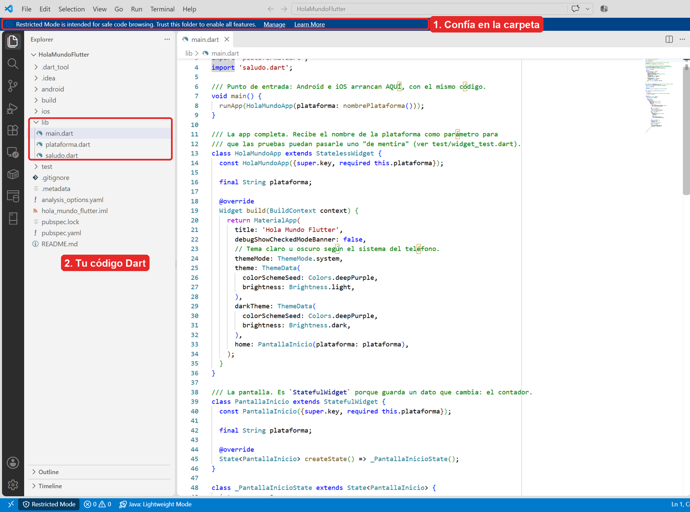

**Android Studio:** **File → Open…** → raíz `HolaMundoFlutter`. Si ya tiene soporte Flutter/Dart, abre `lib/main.dart`, selecciona la configuración Flutter de ese archivo y el emulador, y pulsa ▶. Espera al análisis y a las descargas iniciales. Para ver todos los archivos elige **Project** en el panel izquierdo. Si solo abre `android/`, estarás viendo el anfitrión nativo, no todo el código Dart.

Si aparece **Trust Project**, decide si confías en el código antes de abrirlo. Si falta el plugin Flutter, puedes seguir este tutorial con VS Code y la terminal; Android Studio sigue proporcionando SDK y Device Manager.

**Captura de Android Studio pendiente:** la ventana del proyecto abrió, pero el script de captura y la captura de ventana alternativa devolvieron una imagen negra. No se incorporó ese PNG al tutorial.

## 1.9 Crear el emulador

1. En Android Studio abre **Tools → Device Manager**; desde la pantalla inicial puede estar en **More Actions → Virtual Device Manager**.
2. Pulsa **+ → Create Virtual Device** y elige un perfil de teléfono, por ejemplo Pixel.
3. Elige una imagen reciente de Android. En Windows Intel/AMD usa **x86_64**; en Mac con chip Apple, **arm64-v8a**. Si falta la imagen, descárgala desde el asistente.
4. Da al AVD el nombre **HolaMundo_Phone** y pulsa **Finish**.
5. Pulsa ▶ junto a ese AVD. Espera a que Android muestre la pantalla de inicio antes de instalar.

Las capturas de este tutorial usan **HolaMundo_Phone**, pero sirve cualquier emulador. Un teléfono físico con Depuración USB también sirve; acepta la autorización de tu computadora en el teléfono.

Para listar los AVD y arrancar el del tutorial:
```bash
flutter emulators
```

```bash
flutter emulators --launch HolaMundo_Phone
```


## 1.10 ¡Ejecutar en Android!

Con el emulador encendido, comprueba qué ve Flutter y ejecuta:
```bash
flutter devices
```

```bash
flutter run
```


### Seleccionar dispositivo y leer la salida

Si hay varios dispositivos, elige el Android en la lista. Para fijar el emulador de esta sesión (su número puede variar en otro equipo):
```bash
flutter run -d emulator-5554
```


```text
Launching lib\main.dart on sdk gphone64 x86 64 in debug mode...
Running Gradle task 'assembleDebug'...
√ Built build\app\outputs\flutter-apk\app-debug.apk
Installing build\app\outputs\flutter-apk\app-debug.apk...
Syncing files to device sdk gphone64 x86 64...

Flutter run key commands.
r Hot reload.
R Hot restart.
h List all available interactive commands.
d Detach (terminate "flutter run" but leave application running).
c Clear the screen
q Quit (terminate the application on the device).
```


### Lo que aparece en pantalla

La salida anterior es la **salida real proporcionada para este emulador** en las instrucciones del tutorial; no es una ejecución iOS. `flutter run` queda abierto esperando teclas: escribe `r` para hot reload, `R` para hot restart y `q` para terminar. La primera compilación puede tardar más por descargas y compilación inicial.

En **VS Code**, elige el dispositivo en la barra inferior y pulsa **F5**; verás el resultado en **Debug Console** y los controles de depuración. En Android Studio con el plugin Flutter usa la configuración de `lib/main.dart`, el dispositivo y ▶.

| Recién abierta | Después de tres toques | Modo oscuro, mismo contador |
|:---:|:---:|:---:|
|  | 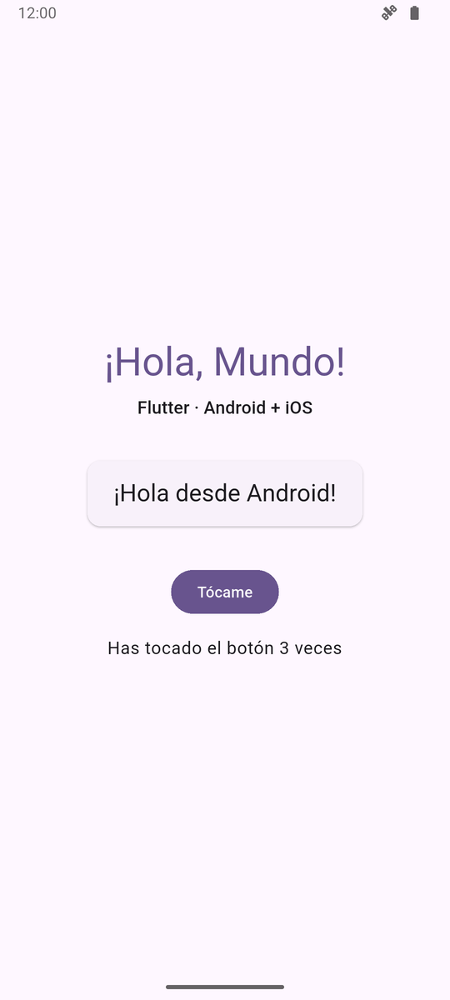 | 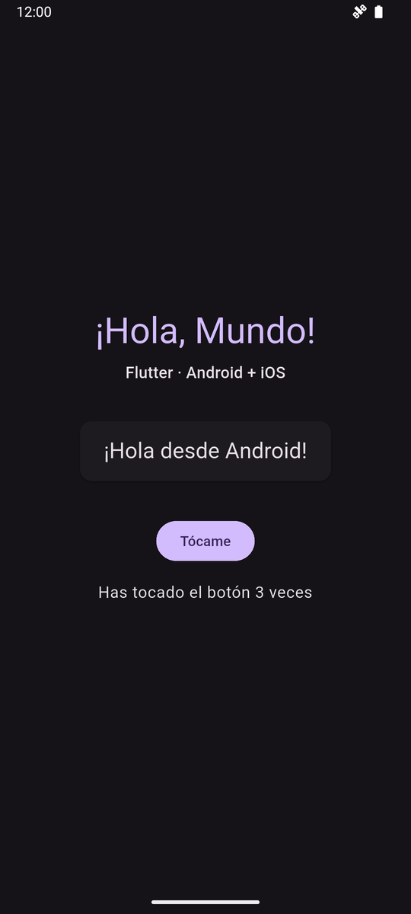 |

La tarjeta muestra **¡Hola desde Android!**. Toca **Tócame** tres veces: el texto debe ser **Has tocado el botón 3 veces**. Activa el modo oscuro del dispositivo: cambian los colores y el contador se conserva. Estas capturas se obtuvieron de la app real del tutorial.

Si solo quieres un APK debug para instalar, este comando termina por sí solo y deja el archivo en `build/app/outputs/flutter-apk/app-debug.apk`:
```bash
flutter build apk --debug
```


## 1.11 Hot reload frente a hot restart

Con una sesión `flutter run` **debug** abierta, toca el botón y cambia el título `'¡Hola, Mundo!'` a `'¡Hola, ESCOM!'` en `lib/main.dart`. Guarda y pulsa `r` en esa terminal. El título cambia y el contador conserva su valor. Si tu editor tiene hot reload al guardar activado, basta guardar; no lo presupongas en todas las instalaciones.

| | Hot reload | Hot restart | Reinicio completo |
|---|---|---|---|
| Terminal / editor | `r` / ⚡ | `R` / control Hot Restart | Detener y ejecutar de nuevo |
| Contador | Se conserva | Vuelve a 0 | Vuelve a 0 |
| `main()` e inicialización | No se ejecutan de nuevo | Sí | Sí |
| Cuándo usar | Textos, colores, cambios de widgets | Estado inicial o cambios que reload no aplica | Kotlin, Swift, permisos, plugins y ajustes nativos |

No prometemos tiempos fijos: dependen del equipo y del cambio. Si reload rechaza un cambio, lee el error, corrige Dart y vuelve a intentar; puede requerir restart. Release no admite hot reload. Más detalles en la [guía oficial de hot reload](https://docs.flutter.dev/tools/hot-reload).

## 1.12 Pruebas: flutter test

Reemplaza la prueba del contador original de la plantilla y crea `saludo_test.dart` con los archivos siguientes. Si dejas la prueba antigua, seguirá buscando textos y botones que ya no existen. Ejecuta desde la raíz:
```bash
flutter test
```


### Pruebas unitarias y prueba de widget

Las pruebas unitarias llaman funciones sin dibujar pantallas. Comprueban ambos sistemas y los casos 0, 1 y plural del contador. La prueba de widget monta la app **en memoria, sin emulador**, inyecta `'Pruebas'`, busca textos, toca tres veces el `FilledButton` y llama `pump()` para procesar cada reconstrucción.
[`test/saludo_test.dart`](test/saludo_test.dart):

```dart
import 'package:flutter_test/flutter_test.dart';

import 'package:hola_mundo_flutter/saludo.dart';

/// Pruebas unitarias: solo lógica, sin widgets. Son las más rápidas.
void main() {
  test('saluda con el nombre de la plataforma', () {
    expect(saludar('Android'), '¡Hola desde Android!');
    expect(saludar('iOS'), '¡Hola desde iOS!');
  });

  test('el contador usa singular y plural', () {
    expect(textoContador(0), 'Todavía no has tocado el botón');
    expect(textoContador(1), 'Has tocado el botón 1 vez');
    expect(textoContador(5), 'Has tocado el botón 5 veces');
  });
}
```

[`test/widget_test.dart`](test/widget_test.dart):

```dart
import 'package:flutter/material.dart';
import 'package:flutter_test/flutter_test.dart';

import 'package:hola_mundo_flutter/main.dart';

/// Prueba de widget: arma la pantalla en memoria (sin teléfono), la "toca"
/// y revisa lo que se ve. Se ejecuta con `flutter test`.
void main() {
  testWidgets('muestra el saludo y cuenta los toques', (WidgetTester tester) async {
    // Se pasa una plataforma "de mentira" para no depender del sistema real.
    await tester.pumpWidget(const HolaMundoApp(plataforma: 'Pruebas'));

    expect(find.text('¡Hola, Mundo!'), findsOneWidget);
    expect(find.text('¡Hola desde Pruebas!'), findsOneWidget);
    expect(find.text('Todavía no has tocado el botón'), findsOneWidget);

    // Tocar el botón 3 veces.
    for (var i = 0; i < 3; i++) {
      await tester.tap(find.widgetWithText(FilledButton, 'Tócame'));
      await tester.pump(); // redibuja después de cada setState
    }

    expect(find.text('Has tocado el botón 3 veces'), findsOneWidget);
  });
}
```


### Resultado real de las pruebas

Salida real de esta verificación, usando el reporte expandido (las rutas personales se omiten en esta vista del resultado):


```text
00:00 +0: loading C:/Users/gabri/OneDrive/Escritorio/FlutterProjects/HolaMundoFlutter/test/saludo_test.dart
00:00 +0: C:/Users/gabri/OneDrive/Escritorio/FlutterProjects/HolaMundoFlutter/test/saludo_test.dart: saluda con el nombre de la plataforma
00:00 +1: C:/Users/gabri/OneDrive/Escritorio/FlutterProjects/HolaMundoFlutter/test/saludo_test.dart: el contador usa singular y plural
00:00 +2: C:/Users/gabri/OneDrive/Escritorio/FlutterProjects/HolaMundoFlutter/test/widget_test.dart: muestra el saludo y cuenta los toques
00:01 +3: All tests passed!
```


Las tres pruebas cubren lógica y widgets. No demuestran firma, compilación ni arranque iOS: eso se debe verificar en Mac. Android también se verifica por separado con el APK y el emulador.

# Parte 2 — iOS (solo Mac)

**Verificado en simulador el 2026-10-08 con Flutter 3.47.6 stable y las herramientas existentes de Xcode 26.6.** Las tres capturas iOS de 2.3 muestran esta app Flutter. Las capturas de ajustes de iPhone son genéricas, copiadas de HolaMundoKMP; no prueban ejecución en un teléfono físico. Después de actualizar a Xcode 27.0 se comprobó también la ejecución desde su interfaz y se obtuvieron las dos capturas de Xcode. El iPhone físico sigue pendiente.

En Windows puedes editar el Dart compartido y ejecutar Android. Para compilar y firmar iOS necesitas macOS con Xcode. No debes aplicar a Flutter las fases Gradle o el framework Shared del tutorial KMP: el anfitrión Flutter ya incluye su integración.

## 2.1 Preparar Xcode y Flutter

1. Instala Xcode compatible con tu macOS y ábrelo una vez para terminar la instalación. Descarga un runtime iOS desde **Settings → Components** (el nombre puede variar según Xcode).
2. En la terminal de la Mac selecciona Xcode y completa su primera ejecución; cambia la ruta si está instalado en otro lugar. Estos comandos son **para preparar tu Mac**, no se ejecutaron en este trabajo Windows:
```bash
sudo xcode-select --switch /Applications/Xcode.app/Contents/Developer
```

```bash
sudo xcodebuild -runFirstLaunch
```

```bash
flutter doctor
```


### Dependencias y revisión en la Mac

Lee y acepta la licencia de Xcode si la solicita. `flutter doctor` debe reconocer Flutter y Xcode. Si falta el runtime iOS, instálalo desde Xcode antes de abrir el simulador. Sigue la [preparación oficial para iOS](https://docs.flutter.dev/platform-integration/ios/setup) para los detalles de tu versión.

Clona el repo como en el inicio, entra en `HolaMundoFlutter` y ejecuta `flutter pub get`. **CocoaPods solo interviene si tus plugins nativos o su integración lo necesitan**; `cupertino_icons` es una fuente, no un plugin. Las plantillas recientes también pueden usar Swift Package Manager. No crees un Podfile ni añadas dependencias a ciegas. Si un plugin exige CocoaPods, sigue su guía y la [instalación de CocoaPods](https://guides.cocoapods.org/using/getting-started.html).

### Verificación real de esta Mac — 2026-10-08

Se reutilizó el clon limpio de GitHub Desktop en `~/Documents/GitHub/Flutter-Projects/HolaMundoFlutter`, revisión `15a8568`; coincide con el repositorio publicado. No se encontraron `AGENTS.md` aplicables. No se creó otro clon ni se sobrescribieron cambios.

| Componente | Resultado comprobado |
|---|---|
| Mac | Apple M1 Pro, arm64, 32 GB; macOS 27.0.1, build 26A434. |
| Git | 2.50.1 (Apple Git-155), existente. |
| Xcode y herramientas | 26.6, build 17F113 en la primera prueba; **27.0, build 27A266a actualmente**; selección `/Applications/Xcode.app/Contents/Developer`; primera ejecución completa. `clang` disponible; SDK del simulador iOS 26.5 en la primera prueba y 27.0 después de actualizar. No hay recibo de Command Line Tools separadas; se usan las incluidas en Xcode. |
| Runtimes existentes | iOS 18.2 e iOS 26.5; se probó únicamente iOS 26.5. |
| VS Code instalado | 1.141.0 arm64, descarga oficial de Microsoft; SHA-256 y firma verificados. |
| Extensiones instaladas | Flutter y Dart de Dart Code, ambas 3.144.0. |
| Flutter instalado | 3.47.6 stable, revisión `5fc346839b`; Dart 3.13.5; `~/dev/flutter`. |
| Configuración | PATH de Flutter y `code` en `~/.zprofile`, sin duplicados; `dart.flutterSdkPath` en los ajustes de usuario de VS Code. Carpeta de este proyecto habilitada y iPhone 17 Pro seleccionado en el editor. |
| Android existente | Android Studio 2026.2, SDK detectado por doctor 36.0.0 y JDK 25.0.3. No se reinstalaron ni se probó Android en esta Mac. |

El ZIP arm64 y el índice de descargas de Flutter devolvieron HTTP 404. Se conservó **la misma versión solicitada** instalando desde la etiqueta `3.47.6` del [repositorio oficial de Flutter](https://github.com/flutter/flutter/tree/3.47.6), en una rama local `stable` fijada a esa revisión; Dart descargado por Flutter es arm64. No se eligió otra versión ni se ejecutó `flutter upgrade`.

`flutter doctor -v` terminó con avisos en **2 categorías**: CocoaPods ausente y Chrome ausente. Flutter, Android toolchain, dispositivos y red pasaron. La app usa Swift Package Manager y no tiene plugins nativos; la compilación iOS terminó **sin instalar CocoaPods**. Chrome no se instaló porque no se probó Web. Doctor también registró avisos de búsqueda de otros teléfonos inalámbricos; no bloquean el simulador.

**Actualización de Xcode comprobada:** la primera prueba usó las herramientas de Xcode 26.6, cuya interfaz no abrió en macOS 27.0.1. El usuario actualizó Xcode a **27.0 (27A266a)** y aceptó su licencia. Se encontró una sola instalación, `/Applications/Xcode.app`; la copia anterior de esa ruta fue reemplazada y los runtimes iOS 18.2 y 26.5 se conservaron. `xcodebuild -checkFirstLaunchStatus` pasó y `flutter doctor -v` reconoce Xcode 27.0, con los mismos avisos de CocoaPods y Chrome ausentes.

Se abrió `ios/Runner.xcworkspace`, se seleccionaron el esquema **Runner** y **iPhone 17 Pro (iOS 26.5)**, y se ejecutó con Run (⌘R). Xcode mostró **Running Runner on iPhone 17 Pro**, con proceso activo en el navegador de depuración; Device Hub mostró **¡Hola desde iOS!** y el contador inicial. Las capturas `xcode-ejecutar.png` y `xcode-signing.png` son ventanas reales de Xcode 27, originales de 2800×1800 y revisadas sin datos personales. No se eligió un Team ni se cambió el Bundle ID. Xcode mostró 25 avisos `Stale file … outside of the allowed root paths` de salidas generadas de la compilación anterior y una recomendación de ajustes; no impidieron ejecutar la app. No se aplicaron los ajustes recomendados. La conversión automática de formato del proyecto (`objectVersion` 54 → 60) se revirtió al cerrar Xcode; no se incluyen cambios nativos.

## 2.2 La carpeta ios/: AppDelegate y escenas

La carpeta ya está generada; no necesitas crear otra app SwiftUI ni pegarle una pantalla KMP. **Runner** es el target de Xcode que arranca Flutter. La plantilla real usa `FlutterImplicitEngineDelegate`: los plugins se registran cuando el motor implícito queda inicializado, mediante `engineBridge.pluginRegistry`.
[`ios/Runner/AppDelegate.swift`](ios/Runner/AppDelegate.swift):

```swift
import Flutter
import UIKit

@main
@objc class AppDelegate: FlutterAppDelegate, FlutterImplicitEngineDelegate {
  override func application(
    _ application: UIApplication,
    didFinishLaunchingWithOptions launchOptions: [UIApplication.LaunchOptionsKey: Any]?
  ) -> Bool {
    return super.application(application, didFinishLaunchingWithOptions: launchOptions)
  }

  func didInitializeImplicitFlutterEngine(_ engineBridge: FlutterImplicitEngineBridge) {
    GeneratedPluginRegistrant.register(with: engineBridge.pluginRegistry)
  }
}
```

[`ios/Runner/SceneDelegate.swift`](ios/Runner/SceneDelegate.swift):

```swift
import Flutter
import UIKit

class SceneDelegate: FlutterSceneDelegate {

}
```


### Info.plist y ciclo de vida

`SceneDelegate` hereda `FlutterSceneDelegate`. iOS separa eventos de la aplicación y de la escena (ventana). `Info.plist` declara esa escena y su storyboard. El valor `$(PRODUCT_MODULE_NAME).SceneDelegate` se resuelve al compilar. **No reemplaces este AppDelegate por el antiguo** que registraba plugins con `self` dentro de `didFinishLaunchingWithOptions`.

Este es el `Info.plist` completo del repo. Para reproducir el nombre, `CFBundleDisplayName` debe contener **Hola Mundo Flutter**. `CFBundleIdentifier` usa el valor de Xcode; no se fija aquí a mano. La versión y el número de compilación vienen de Flutter:
[`ios/Runner/Info.plist`](ios/Runner/Info.plist):

```xml
<?xml version="1.0" encoding="UTF-8"?>
<!DOCTYPE plist PUBLIC "-//Apple//DTD PLIST 1.0//EN" "http://www.apple.com/DTDs/PropertyList-1.0.dtd">
<plist version="1.0">
<dict>
	<key>CADisableMinimumFrameDurationOnPhone</key>
	<true/>
	<key>CFBundleDevelopmentRegion</key>
	<string>$(DEVELOPMENT_LANGUAGE)</string>
	<key>CFBundleDisplayName</key>
	<string>Hola Mundo Flutter</string>
	<key>CFBundleExecutable</key>
	<string>$(EXECUTABLE_NAME)</string>
	<key>CFBundleIdentifier</key>
	<string>$(PRODUCT_BUNDLE_IDENTIFIER)</string>
	<key>CFBundleInfoDictionaryVersion</key>
	<string>6.0</string>
	<key>CFBundleName</key>
	<string>hola_mundo_flutter</string>
	<key>CFBundlePackageType</key>
	<string>APPL</string>
	<key>CFBundleShortVersionString</key>
	<string>$(FLUTTER_BUILD_NAME)</string>
	<key>CFBundleSignature</key>
	<string>????</string>
	<key>CFBundleVersion</key>
	<string>$(FLUTTER_BUILD_NUMBER)</string>
	<key>LSRequiresIPhoneOS</key>
	<true/>
	<key>UIApplicationSceneManifest</key>
	<dict>
		<key>UIApplicationSupportsMultipleScenes</key>
		<false/>
		<key>UISceneConfigurations</key>
		<dict>
			<key>UIWindowSceneSessionRoleApplication</key>
			<array>
				<dict>
					<key>UISceneClassName</key>
					<string>UIWindowScene</string>
					<key>UISceneConfigurationName</key>
					<string>flutter</string>
					<key>UISceneDelegateClassName</key>
					<string>$(PRODUCT_MODULE_NAME).SceneDelegate</string>
					<key>UISceneStoryboardFile</key>
					<string>Main</string>
				</dict>
			</array>
		</dict>
	</dict>
	<key>UIApplicationSupportsIndirectInputEvents</key>
	<true/>
	<key>UILaunchStoryboardName</key>
	<string>LaunchScreen</string>
	<key>UIMainStoryboardFile</key>
	<string>Main</string>
	<key>UISupportedInterfaceOrientations</key>
	<array>
		<string>UIInterfaceOrientationPortrait</string>
		<string>UIInterfaceOrientationLandscapeLeft</string>
		<string>UIInterfaceOrientationLandscapeRight</string>
	</array>
	<key>UISupportedInterfaceOrientations~ipad</key>
	<array>
		<string>UIInterfaceOrientationPortrait</string>
		<string>UIInterfaceOrientationPortraitUpsideDown</string>
		<string>UIInterfaceOrientationLandscapeLeft</string>
		<string>UIInterfaceOrientationLandscapeRight</string>
	</array>
</dict>
</plist>
```


### Workspace, proyecto y recursos de iOS

| Ruta | Qué contiene |
|---|---|
| `ios/Runner.xcworkspace` | Workspace que debes abrir para trabajar con Runner y las dependencias integradas. |
| `ios/Runner.xcodeproj` | Configuración del proyecto, targets, Bundle ID, firma y compilación. Forma parte del workspace. |
| `ios/Runner/AppDelegate.swift`, `SceneDelegate.swift` | Arranque y ciclo de vida del anfitrión Flutter. |
| `ios/Runner/Info.plist` | Nombre visible, orientaciones y configuración de escena. |
| `ios/Runner/Assets.xcassets` | Íconos y recursos de arranque. |
| `ios/Runner/Base.lproj` | `Main.storyboard` y `LaunchScreen.storyboard`. |
| `ios/Flutter` | Configuración Flutter; no copies las rutas de los archivos generados a otro equipo. |

Abre el **workspace**, no solo el `.xcodeproj`, especialmente cuando hay dependencias nativas. No edites `GeneratedPluginRegistrant` ni los archivos efímeros para registrar paquetes manualmente. Consulta la [migración oficial a UIScene](https://docs.flutter.dev/release/breaking-changes/uiscenedelegate) si estás adaptando una app antigua.
```bash
open ios/Runner.xcworkspace
```


## 2.3 Ejecutar en el simulador

1. Abre el simulador en la Mac:
```bash
open -a Simulator
```

```bash
flutter devices
```

```bash
flutter run
```


### Seleccionar el iPhone simulado

2. En Simulator elige un iPhone desde **File → Open Simulator** si todavía no hay ninguno arrancado. En versiones que llaman **Device Hub** a esta app, usa el nombre instalado; la [guía de iOS](https://docs.flutter.dev/platform-integration/ios/setup) distingue `open -a Simulator` (Xcode 26 o anterior) y `open -a DeviceHub` (Xcode 27).
3. Busca su ID en `flutter devices`. Si hay varios destinos, elige el simulador en el menú de `flutter run`, o usa `flutter run -d ID_DEL_SIMULADOR`, sustituyendo el ID por el real.
4. En VS Code puedes elegir el iPhone en la barra inferior y pulsar F5. En Xcode elige **Runner**, el simulador y ▶ (⌘R); para practicar hot reload, usa la sesión de Flutter de la terminal o el editor.
5. En la verificación del 2026-10-08, la tarjeta mostró **¡Hola desde iOS!**. El contador inicial mostró **Todavía no has tocado el botón**; después de tres toques reales mostró **Has tocado el botón 3 veces**. Al cambiar el simulador a oscuro sin reiniciar, conservó el contador en 3. Después, hot restart (`R`) devolvió el contador a 0. No se modificó el comportamiento ni se implementó Reiniciar.

Se identificó el iPhone con `flutter devices` y se ejecutó explícitamente este destino iOS:

```bash
flutter run -d EA4C8D0F-B2B1-4330-AD6D-3B62A42F98F0
```

Resultados reales desde `HolaMundoFlutter`:

| Comprobación | Resultado |
|---|---|
| `flutter pub get` | Correcto; lock conservado. Aviso de 8 paquetes con versiones nuevas fuera de las restricciones; no se actualizaron. |
| `flutter analyze` | `No issues found! (ran in 0.8s)` |
| `flutter test` | `00:00 +3: All tests passed!` — 3/3 pruebas. |
| Compilación y ejecución | `Launching lib/main.dart on iPhone 17 Pro in debug mode...`; `Xcode build done. 39.4s`; sincronización y Dart VM Service activos. |
| Destino | iPhone 17 Pro, iOS 26.5, simulador arm64. No se seleccionaron `macos` ni Web. |
| Hot restart | `Restarted application in 242ms.` y contador inicial comprobado en pantalla. |

| Recién abierta | Después de tres toques | Modo oscuro, mismo contador |
|:---:|:---:|:---:|
|  | 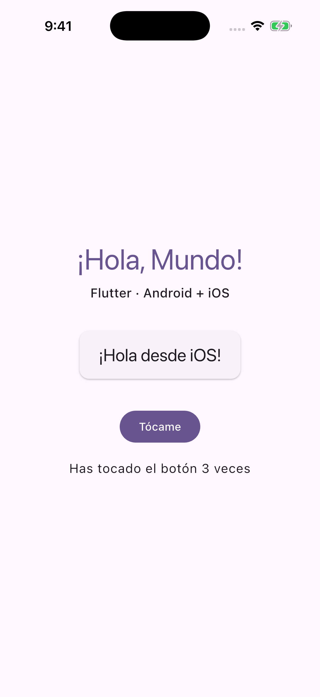 | 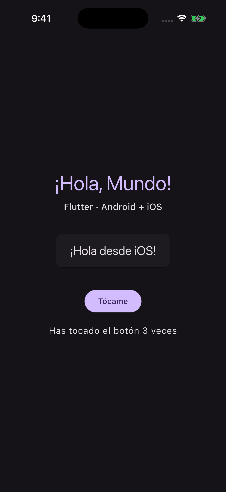 |

Las tres capturas originales de 1206×2622 se obtuvieron con `simctl` y se revisaron visualmente: solo muestran esta app y la barra de estado, sin cuentas, notificaciones ni otras apps. La ejecución adicional desde Xcode 27.0 se muestra abajo; el esquema Runner y el iPhone 17 Pro están visibles, junto con el proceso activo. Los avisos nativos de esa compilación se detallan en 2.1.

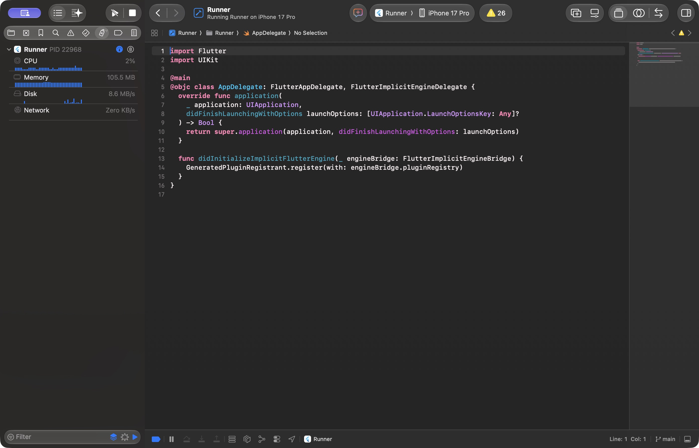

## 2.4 Ejecutar en un iPhone real

Necesitas una Mac, Xcode compatible con el iOS del teléfono, cable y Apple ID. La configuración del proyecto declara iOS **15.0** como deployment target; los requisitos de Flutter, Xcode o un plugin pueden elevar el mínimo efectivo. Se verificó iOS 26.5 en simulador; no se ha verificado un iPhone físico. `flutter devices` detectó un teléfono inalámbrico con iOS 26.7.1, pero no se compiló, instaló ni comprobó la app en él; no se configuró su firma.

| Paso | Android | iPhone |
|---|---|---|
| Desarrollo | Opciones de desarrollador y Depuración USB | Modo de desarrollador |
| Cable | Permitir depuración USB | Confiar en esta computadora |
| Firma local | Clave debug | Apple ID y Team en Xcode |
| Primera apertura | Instalación normal | Puede requerir confiar en el certificado |

**1. Cuenta y firma.** En Xcode → **Settings → Apple Accounts** añade tu Apple ID. Abre `ios/Runner.xcworkspace`, selecciona proyecto **Runner** → target **Runner** → **Signing & Capabilities**. Marca **Automatically manage signing** y elige tu **Team** (puede ser Personal Team para pruebas).

**2. Bundle ID único.** Cambia `com.example.holaMundoFlutter` por uno tuyo, por ejemplo `com.tunombre.miapp`. No uses el Bundle ID de otra cuenta; configura coherentemente Debug, Profile y Release. Si cambias el target de pruebas, revisa también su identificador. No cambia el código Dart del saludo.

**Signing & Capabilities (Xcode 27.0):** la captura muestra la configuración actual, con **Team: None** y el identificador de ejemplo. El aviso de que se requiere un equipo corresponde a la preparación de firma; no impidió ejecutar en el simulador. **No demuestra firma ni ejecución en un iPhone físico**, que siguen pendientes. No hay cuentas ni datos personales visibles.

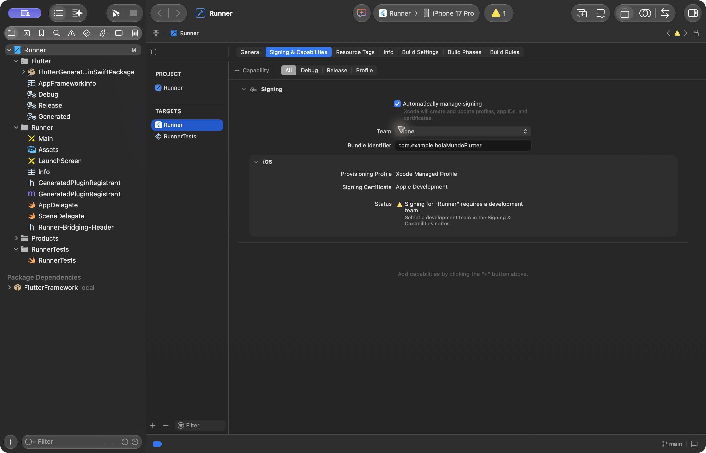

**3. Conectar y confiar.** Conecta el iPhone, desbloquéalo, acepta **¿Confiar en esta computadora?** y escribe el código en el teléfono. Elige tu iPhone como destino en Xcode y espera si indica que lo está preparando.

**4. Modo de desarrollador.** En el iPhone: **Configuración/Ajustes → Privacidad y seguridad → Modo de desarrollador** → activar → reiniciar → desbloquear y confirmar **Activar**. Si no aparece, conecta primero el iPhone a la Mac y deja que Xcode lo detecte.

| Privacidad y seguridad | Modo de desarrollador |
|:---:|:---:|
| 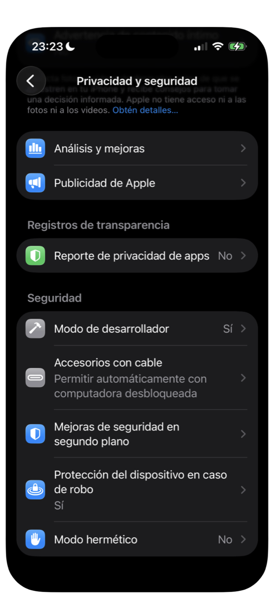 | 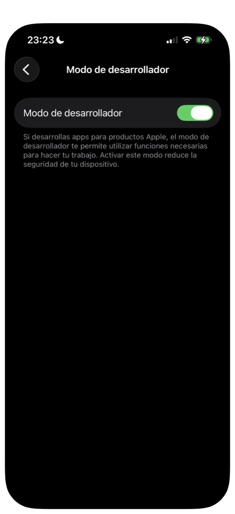 |

**5. Ejecutar.** Vuelve a la raíz del proyecto en la terminal de la Mac, revisa `flutter devices` y ejecuta `flutter run` eligiendo el iPhone. Xcode puede solicitar acceso a la clave de firma. Si aparece **Unlock iPhone to Continue**, desbloquea el teléfono; si indica **Developer Mode disabled**, revisa el paso anterior.

**6. Confiar en el desarrollador.** Si aparece **Untrusted Developer / Desarrollador no confiable**, ve a **Configuración → General → Admón. de dispositivos y VPN** (o **VPN y gestión de dispositivos**) → **App del desarrollador** → tu cuenta → **Confiar / Verificar app**. El teléfono necesita internet para verificar. Si el menú no aparece, intenta instalar/ejecutar la app una vez y vuelve a revisar.

| Gestión de dispositivos | App Flutter en el iPhone |
|:---:|:---:|
| 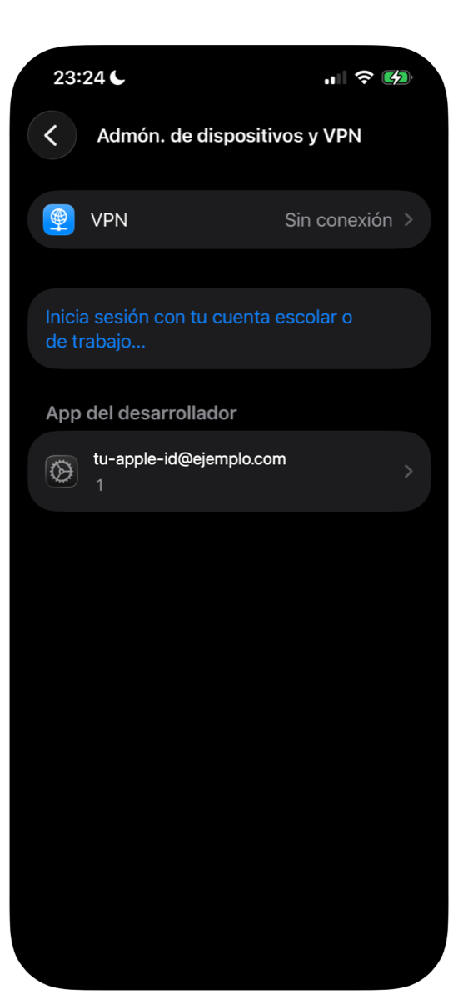 | Captura pendiente (Mac) |

Estas tres capturas de ajustes se copiaron de la referencia KMP **porque son genéricas**. Los datos de cuenta en la imagen de gestión están anonimizados; no uses esa imagen para afirmar que Flutter ya está instalada o verificada.

**7. Abrir desde el ícono.** En un iPhone, una app Flutter **debug** debe arrancar con Flutter, el editor o Xcode; puede cerrarse al tocar su ícono sin esas herramientas. Para dejar una versión que arranque desde la pantalla de inicio, selecciona el iPhone físico y ejecuta:
```bash
flutter run --release
```


### Comprobar la instalación en el iPhone

Release no ofrece hot reload y debe probarse en **dispositivo físico**, no como sustituto de la sesión debug del simulador. Si hay varios destinos usa el ID real con `flutter run --release -d ID_DEL_IPHONE`. Después de instalarla, prueba abrirla desde el ícono, el saludo, tres toques y el tema oscuro. Guarda `iphone-hola-mundo.png` cuando lo verifiques.

Una cuenta Personal Team tiene límites y su firma de pruebas puede caducar; vuelve a firmar desde tu Mac cuando ocurra. Para distribuir revisa los requisitos actuales de Apple. El problema del arranque debug está documentado por el [proyecto Flutter](https://github.com/flutter/flutter/issues/66491).

## 2.5 Equivalencias entre Android e iOS

| Android | iOS | Para qué |
|---|---|---|
| `MainActivity.kt` | `AppDelegate.swift` + `SceneDelegate.swift` | Arranque y ciclo de vida del anfitrión Flutter. No son traducciones línea por línea. |
| `AndroidManifest.xml` | `Info.plist` | Nombre visible, configuración y permisos; iOS también pide textos de explicación para permisos. |
| `applicationId` | Bundle Identifier de Runner | Identidad de la app instalada. |
| `android:label` | `CFBundleDisplayName` | Nombre bajo el ícono. |
| `res/mipmap-*/ic_launcher.png` | `Assets.xcassets/AppIcon.appiconset` | Íconos de lanzamiento. |
| Gradle | Xcode y dependencias nativas (SPM/CocoaPods según integración) | Compilar y empaquetar el anfitrión. |
| AVD en Device Manager | Dispositivo en Simulator | Teléfono virtual para desarrollo. |

Los permisos y los íconos son configuración nativa; el saludo, el contador y sus pruebas permanecen en Dart. Añadir plugins es la forma usual de acceder a cámara, ubicación u otras APIs; verifica que el paquete soporte ambas plataformas.

# Parte 3 — ¿Y ahora qué?

Ya tienes un contador. Ahora practica con un cambio pequeño que puedas observar y probar. Los ejercicios siguientes son **propuestas para ti**, no funciones implementadas actualmente en este repo.

## 3.1 El mismo cambio en las dos plataformas

En una **Mac** con emulador Android y simulador iOS encendidos, revisa `flutter devices` y lanza todos los destinos compatibles:
```bash
flutter run -d all
```


### Practicar hot reload

1. Deja conectados solo los destinos que quieras probar: `-d all` puede incluir otros dispositivos disponibles, no significa exclusivamente Android+iOS.
2. Toca el botón en cada pantalla: cada proceso tiene su contador propio.
3. Cambia el título en `lib/main.dart` por `'¡Hola, ESCOM!'`, guarda y pulsa `r` en la sesión de Flutter.
4. Comprueba que cambió el título en ambos y que **cada uno** conservó su contador. Luego prueba `R` y observa que vuelve a 0.

En Windows practica lo mismo solo en Android. La ejecución simultánea con iOS sigue pendiente de la Mac. Otro ejercicio: cambia `Colors.deepPurple` por `Colors.teal` en **los dos** temas y comprueba claro/oscuro. La UI no necesita cambios Swift ni Kotlin para esos ejercicios.

| Tipo de cambio | Dónde trabajas |
|---|---|
| Lógica y textos | `lib/saludo.dart` y pruebas unitarias. |
| Pantalla, botones y estado | `lib/main.dart` y prueba de widget. |
| Sistema / plataforma | `lib/plataforma.dart`, plugins o integración nativa si se necesita. |
| Permisos e identidad Android | `android/`. |
| Firma, escenas y permisos iOS | `ios/`. |

## 3.2 Ejercicio: botón Reiniciar y su prueba

Añade debajo del `Text` del contador un **OutlinedButton** llamado **Reiniciar**. Al tocarlo, el contador debe volver a 0 y mostrar **Todavía no has tocado el botón**. Después, **Tócame** debe volver a contar desde 1.

<details>
<summary>Ver solución propuesta (no está en el archivo actual)</summary>

Dentro de `children: [...]` de `_PantallaInicioState.build()`, inmediatamente después del `Text(textoContador(_veces), ...)`, añade estos widgets. Es una inserción, no un reemplazo del archivo completo:

```dart
const SizedBox(height: 8),
OutlinedButton(
  onPressed: () => setState(() => _veces = 0),
  child: const Text('Reiniciar'),
),
```

</details>

Extiende la prueba existente después de comprobar los tres toques. No crees una prueba que solo revise si existe el botón: comprueba el cambio de texto y que se pueda volver a contar.

<details>
<summary>Ver prueba propuesta (solo después de añadir el botón)</summary>

```dart
await tester.tap(find.widgetWithText(OutlinedButton, 'Reiniciar'));
await tester.pump();
expect(find.text('Todavía no has tocado el botón'), findsOneWidget);

await tester.tap(find.widgetWithText(FilledButton, 'Tócame'));
await tester.pump();
expect(find.text('Has tocado el botón 1 vez'), findsOneWidget);
```

</details>

Esta solución y su prueba se ofrecen como ejercicio; **no se aplicaron a `lib/` ni a `test/`**. Ejecuta después `flutter analyze` y `flutter test`. Si falla la búsqueda de Reiniciar, comprueba que añadiste el botón, guardaste el archivo y no pegaste el fragmento fuera de `children`.

## 3.3 Siguientes pasos recomendados

| Objetivo | Primer paso |
|---|---|
| Una segunda pantalla | Practica `Navigator.push` / `pop` y el [recetario de navegación](https://docs.flutter.dev/cookbook/navigation). |
| Añadir funciones | Busca en [pub.dev](https://pub.dev), revisa plataformas, mantenimiento y documentación. Sigue la [guía de paquetes](https://docs.flutter.dev/packages-and-plugins/using-packages). |
| Estado compartido | Aprende primero estado local con `setState`; después `ChangeNotifier` y otras [opciones de gestión de estado](https://docs.flutter.dev/data-and-backend/state-mgmt/options). |
| Datos que sobreviven al cierre | Elige almacenamiento apropiado y prueba lectura/escritura; `_veces` todavía no se persiste. |
| Más confianza | Añade pruebas de los casos nuevos y verifica Android e iOS reales cuando uses APIs del sistema. |

Para añadir un paquete usa `flutter pub add nombre_del_paquete`, sustituyendo el nombre por uno real. No instales varios gestores de estado para este contador: comienza con un objetivo pequeño que puedas verificar.

# Parte 4 — Usar este repo como base para tu app

Puedes partir de este proyecto y cambiarlo poco a poco. Primero confirma que la copia original funciona en tu equipo; después personaliza identidad y contenido. Así distinguirás un problema del entorno de uno introducido al renombrar.

## 4.1 Qué necesitas para que corra

| Destino | Necesitas |
|---|---|
| Emulador Android | Flutter, Android Studio/SDK y AVD arrancado; `flutter pub get`. |
| Teléfono Android | Lo anterior más Depuración USB y autorización del equipo; no necesitas un emulador. |
| Simulador iOS | Mac, Flutter, Xcode y runtime iOS; dependencias nativas solo si los plugins las requieren. |
| iPhone físico | Lo anterior más Apple ID, Team, Bundle ID único, Modo de desarrollador y confianza del certificado. |

No necesitas copiar rutas SDK del autor. Tampoco necesitas Android Studio para compilar **solo iOS** si ya tienes Flutter y Xcode correctamente instalados. El JDK/Gradle corresponde al destino Android.

## 4.2 Qué cambiar para que sea TU app

| Qué | Dónde | Ejemplo |
|---|---|---|
| Nombre del paquete Dart | `pubspec.yaml` → `name` | `mi_app`, en minúsculas con guiones bajos. |
| Imports del paquete | `test/*.dart` y cualquier `package:hola_mundo_flutter/...` | `package:mi_app/main.dart`. Los imports relativos de `lib/` pueden seguir iguales. |
| Identificador Android | `android/app/build.gradle.kts` → `applicationId` | `com.tunombre.miapp`. |
| Namespace Android | Mismo archivo → `namespace` | `com.tunombre.miapp`. |
| Paquete y carpeta Kotlin | `android/app/src/main/kotlin/com/example/hola_mundo_flutter/MainActivity.kt` | Mover a `com/tunombre/miapp/MainActivity.kt` y cambiar `package com.tunombre.miapp`. |
| Bundle ID iOS | Xcode → Runner → General / Signing & Capabilities | `com.tunombre.miapp`; revisa todas las configuraciones y RunnerTests. |
| Quién firma iOS | Runner → Signing & Capabilities → Team | Tu Personal Team o equipo. |
| Nombre bajo el ícono Android | `AndroidManifest.xml` → `android:label` | `Mi App`. |
| Nombre bajo el ícono iOS | `ios/Runner/Info.plist` → `CFBundleDisplayName` | `Mi App`. |
| Nombre interno iOS | `Info.plist` → `CFBundleName` | Revisa `hola_mundo_flutter` si quieres personalizarlo. |
| Título y textos | `lib/main.dart`, `lib/saludo.dart` y pruebas | Tu título, descripción, saludo y expectativas nuevas. |
| Íconos | Recursos Android y `Assets.xcassets/AppIcon.appiconset` | Generación con flutter_launcher_icons, abajo. |
| Versión | `pubspec.yaml` → `version` | `1.0.0+1` y siguientes números propios. |

**Orden para renombrar:** cambia `name`, actualiza imports, ejecuta `flutter pub get` y revisa las pruebas. Después cambia los identificadores nativos. Usa Refactor → Rename en Android Studio o mueve con cuidado `MainActivity.kt` y actualiza su línea `package`.

El manifiesto usa `.MainActivity`: mantén el paquete de esa clase coherente con `namespace`. Si cambias solo la carpeta o solo el namespace, puedes provocar que la clase no se encuentre al abrir la app. El nombre Dart, el applicationId y el Bundle ID son identificadores diferentes: cambiar uno no actualiza automáticamente los demás.

## 4.3 Qué conviene no cambiar

Conserva los nombres `lib/`, `android/`, `ios/`, `main.dart`, el módulo Gradle `:app` y el target/workspace **Runner** salvo que tengas una razón concreta. No hace falta renombrar Runner para cambiar el nombre que ve el usuario. Mantén el Wrapper, las opciones de la plantilla y el registro generado de plugins; evita editar archivos efímeros y de compilación.

No cambies versiones de Gradle, AGP y Kotlin por separado sin revisar compatibilidad con Flutter. La plantilla release de Android todavía firma con la clave **debug**: sirve para pruebas, pero para distribuir tu app configura una firma propia siguiendo la [guía oficial de publicación Android](https://docs.flutter.dev/deployment/android). Este tutorial no publica ni firma una versión de tienda.

## 4.4 Íconos y revisión del nombre viejo

Para tu futura app puedes usar [flutter_launcher_icons](https://pub.dev/packages/flutter_launcher_icons). Estos pasos **son opcionales y no se ejecutaron aquí**. Añade la dependencia de desarrollo:
```bash
flutter pub add --dev flutter_launcher_icons
```


### Generar íconos y verificar tu copia

Crea primero tu imagen cuadrada en `assets/icono.png` (por ejemplo 1024×1024) y añade esta **configuración propuesta**, que no forma parte del `pubspec.yaml` actual, como entrada de nivel raíz en tu `pubspec.yaml`:

```yaml
flutter_launcher_icons:
  android: true
  ios: true
  image_path: "assets/icono.png"
  remove_alpha_ios: true
```

Genera los recursos nativos:
```bash
dart run flutter_launcher_icons
```

```bash
git grep -n "hola_mundo_flutter\|holaMundoFlutter"
```


### Comprobar después de personalizar

El `git grep` busca restos en archivos **seguidos por Git**; puede seguir encontrando ejemplos en el README y hay que interpretar cada coincidencia. Si tu carpeta es una descarga sin `.git`, ese comando no funcionará: busca los nombres desde el editor o trabaja en un clon del repo. No es necesario hacer commit para comprobar tu app.

Después de renombrar o cambiar íconos, ejecuta las verificaciones y prueba abrir la app en los dispositivos. Los cambios nativos requieren detener y volver a ejecutar, no solo hot reload:
```bash
flutter analyze
```

```bash
flutter test
```

```bash
flutter build apk --debug
```


## Problemas frecuentes

Los mensajes siguientes sirven para reconocer problemas; **no son salidas nuevas inventadas de esta ejecución**. Los casos de Gradle viejo corresponden a proyectos antiguos, no a la plantilla actual de este repo.

| Mensaje o síntoma | Causa y solución |
|---|---|
| `Error: No pubspec.yaml file found.` | Estás fuera de la raíz Flutter. Entra en la carpeta que contiene `pubspec.yaml` y repite el comando. |
| `Your project's Gradle version (8.12.0) is lower than Flutter's minimum supported version of 8.14.0` | Proyecto creado con Flutter antiguo. Compara con una plantilla nueva del mismo SDK y actualiza Gradle/AGP de manera compatible. Regenerar `android/` exige preservar permisos, firma, íconos y personalizaciones. Este repo ya usa 9.3.1. |
| `What went wrong: 25.0.3` | Gradle antiguo con Java 25 de Android Studio 2026. Actualiza Gradle y plugins compatibles o, en ese proyecto antiguo, indica un JDK 21 instalado con `flutter config --jdk-dir` y su ruta. **Ese ajuste es global**; no hace falta en este repo y no se aplicó aquí. |
| `Your project path contains non-ASCII characters` / `ShaderCompilerException … Could not write file` | Ruta con acentos en Windows, por ejemplo `OneDrive\Imágenes`. Mueve o clona en una ruta sin acentos como `C:\dev\HolaMundoFlutter`. |
| Barra **Restricted Mode** en VS Code | La carpeta no es de confianza. Si reconoces el origen, **Manage → Trust**. |
| `Requested internal only, but not enough space` | Almacenamiento del emulador lleno. Usa un AVD nuevo o **Wipe Data** (borra sus datos). |
| `Android license status unknown` | Instala Command-line Tools si faltan y ejecuta `flutter doctor --android-licenses`; lee y acepta las licencias. |
| `No supported devices connected` / `No devices found` | Arranca un AVD o conecta/autoriza el teléfono; confirma con `flutter devices`. |
| Fallan las pruebas tras sustituir main.dart | Sigue activa la prueba del contador original. Reemplázala por los archivos reales de 1.12 y ajusta expectativas si personalizaste textos. |
| Cambia el dato pero no el texto | En este contador el cambio debe ir dentro de `setState`; llama `pump()` después del toque en pruebas. |
| El contador vuelve a 0 | Hot restart, cierre o nuevo proceso: no hay persistencia. Hot reload conserva el `State` existente. |
| Aviso `WARNING: Use --enable-native-access=ALL-UNNAMED…` al compilar | Aviso del JDK al arrancar Gradle; la compilación de este tutorial finalizó correctamente con él. Mira el resultado final antes de tratarlo como un fallo. |
| `Xcode installation is incomplete` | En Mac termina primera ejecución, selección de Xcode y runtimes de 2.1. |
| `No profiles for 'com.example.holaMundoFlutter'` | Falta Team/firma o el Bundle ID no está disponible. En Runner configura Automatically manage signing, tu Team y un Bundle ID propio; elige el iPhone conectado. |
| `Untrusted Developer` | En el iPhone confía en el certificado desde General → VPN y gestión de dispositivos. |
| La app se cierra al abrir desde el ícono en debug | Arráncala con Flutter/editor/Xcode, o instala `flutter run --release` en el iPhone físico. |
| `CocoaPods not installed` | Si un plugin nativo requiere CocoaPods, instálalo en Mac siguiendo su guía y repite `flutter pub get` / la compilación. No afecta al Android ni implica que esta app sin plugins nativos lo necesite. |
| `Unable to boot the Simulator` | Revisa que Xcode tenga el runtime iOS instalado y un dispositivo virtual disponible. |
| `Developer Mode disabled` / `Unlock iPhone to Continue` | Activa Modo de desarrollador / desbloquea el iPhone y vuelve a ejecutar. |
| No aparece Modo de desarrollador | Conecta, desbloquea y confía en la Mac; deja que Xcode inicie la configuración y revisa de nuevo Privacidad y seguridad. |
| Error tras pegar AppDelegate de un tutorial viejo | Conserva el registro de plugins en `didInitializeImplicitFlutterEngine` y la configuración de escenas del repo; revisa 2.2. |

Si falla un comando, guarda su mensaje completo, identifica si ocurrió al analizar Dart, compilar Gradle, compilar Xcode o instalar. No cambies varias versiones ni borres configuración nativa como primer intento.

## Versiones usadas

Verificado en **Windows 11 el 2026-10-07 y 2026-10-08** mediante `flutter --version`, los archivos de Android y las comprobaciones de este tutorial. La restricción Dart del pubspec no se confunde con el SDK ejecutado.

| Pieza | Versión / origen |
|---|---|
| Flutter | **3.47.6**, stable, revisión `5fc346839b`. |
| Dart | **3.13.5**; `pubspec.yaml` conserva la restricción `^3.8.0`. |
| Gradle | **9.3.1**, `android/gradle/wrapper/gradle-wrapper.properties`. |
| Android Gradle Plugin | **9.1.0**, `android/settings.gradle.kts`. |
| Kotlin (declarado) | **2.4.0**, `android/settings.gradle.kts`. |
| Java / JVM de destino | **17**, `compileOptions` y `kotlin.compilerOptions.jvmTarget`. |
| JDK que ejecuta Gradle | Java 25 de Android Studio en este entorno; distinto del destino 17. |
| flutter_lints | **^6.0.0**, `pubspec.yaml`. |
| cupertino_icons | **^1.0.8**, `pubspec.yaml`. |
| SDK Android | `compileSdk`, `minSdk`, `targetSdk` delegados a Flutter en el archivo real; no se fijan aquí números ajenos al código. |
| AVD | **HolaMundo_Phone**, pantalla 1080×2400; capturas reducidas a 540×1200. |
| applicationId / namespace | `com.example.hola_mundo_flutter`. |
| Bundle ID de Runner | `com.example.holaMundoFlutter`, `ios/Runner.xcodeproj/project.pbxproj`. |
| iOS deployment target declarado | **15.0** en el proyecto Xcode; probado en simulador iOS 26.5, no en iOS 15. |
| Versión de la app | **1.0.0+1**, `pubspec.yaml`. |

**Validación Android:** análisis sin incidencias, **3/3 pruebas** y compilación APK debug correcta; capturas del emulador de esta app. **Validación iOS (Mac, 2026-10-08):** análisis sin incidencias, 3/3 pruebas, compilación debug y ejecución en iPhone 17 Pro con iOS 26.5; saludo, contador inicial, tres toques, modo oscuro conservando 3 y hot restart a 0 comprobados. Ejecución desde Xcode 27.0 y capturas de Xcode obtenidas; entorno y avisos documentados en 2.1. iPhone físico y Android en esta Mac siguen pendientes. No se modificaron código, dependencias, firma ni el ejercicio opcional.

## Estructura final

Árbol resumido del proyecto; se omiten cachés, salidas de compilación y archivos personales. `docs/` contiene solo `capturas/`. Los archivos de trabajo de esta revisión se conservan en `.codex-tmp/`, excluida por `.gitignore`.
```text
HolaMundoFlutter/
├── pubspec.yaml
├── pubspec.lock
├── analysis_options.yaml
├── .gitignore
├── .metadata
├── lib/
│   ├── main.dart
│   ├── saludo.dart
│   └── plataforma.dart
├── test/
│   ├── saludo_test.dart
│   └── widget_test.dart
├── android/
│   ├── build.gradle.kts
│   ├── settings.gradle.kts
│   ├── gradle.properties
│   ├── gradlew / gradlew.bat
│   ├── gradle/wrapper/
│   └── app/
│       ├── build.gradle.kts
│       └── src/main/
│           ├── AndroidManifest.xml
│           ├── kotlin/com/example/hola_mundo_flutter/MainActivity.kt
│           └── res/
├── ios/
│   ├── Runner.xcworkspace/
│   ├── Runner.xcodeproj/
│   ├── Flutter/
│   ├── RunnerTests/
│   └── Runner/
│       ├── AppDelegate.swift
│       ├── SceneDelegate.swift
│       ├── Info.plist
│       ├── Assets.xcassets/
│       └── Base.lproj/
├── docs/capturas/
│   ├── android-hola-mundo.png
│   ├── android-tres-toques.png
│   ├── android-modo-oscuro.png
│   ├── ios-hola-mundo.png
│   ├── ios-tres-toques.png
│   ├── ios-modo-oscuro.png
│   ├── xcode-signing.png
│   ├── xcode-ejecutar.png
│   ├── vscode-modo-restringido.png
│   ├── iphone-privacidad.png
│   ├── iphone-modo-desarrollador.png
│   └── iphone-admon-dispositivos.png
├── README.md
└── README.es.md
```


## Capturas pendientes

Ya están disponibles `ios-hola-mundo.png`, `ios-tres-toques.png`, `ios-modo-oscuro.png`, `xcode-signing.png` y `xcode-ejecutar.png`. Se conserva como pendiente la evidencia que no se pudo verificar:

| Archivo pendiente | Qué falta |
|---|---|
| `iphone-hola-mundo.png` | Ejecutar esta app en un iPhone físico y verificar su firma; la detección inalámbrica no prueba ejecución. |
| `as-proyecto.png` (Windows) | Android Studio con raíz y árbol del proyecto visibles, sin diálogos ni datos personales; ancho 1600 px. No se obtuvo en esta sesión iOS. |

La ejecución Android en esta Mac y la ejecución simultánea Android+iOS no se verificaron; se conserva la evidencia anterior de Windows. No se probaron macOS ni Web. Antes de incorporar cualquier nueva captura, revisa cuentas, correos, avatares, notificaciones y otras apps; las imágenes genéricas de ajustes no sustituyen la prueba de un teléfono físico.
